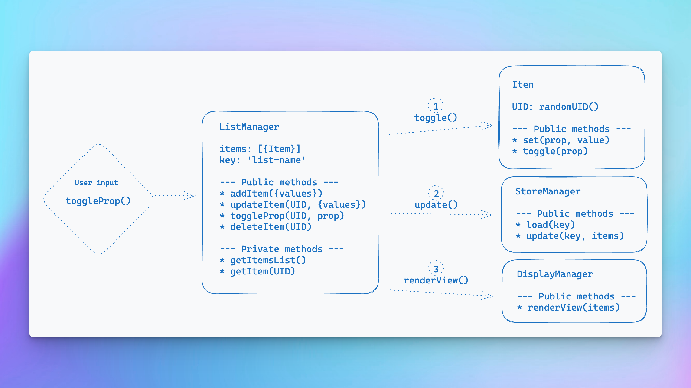

Recently I was completing the To-Do exercise from [The Odin Project](https://www.theodinproject.com) Javascript course and was tackling how to organise my code. The course had just dived into JS Classes and OOP concepts, so I was inclined to try to explore those ideas, especially limiting the direction and scope of messages passing between objects, as well as leveraging object inheritance.

A week or so earlier I had been digging through the code for the [Astro docs](https://astro.build/) looking at [how they implemented their tutorial tracking](https://github.com/withastro/docs/blob/main/src/components/tutorial/ProgressStore.ts). The Astro example uses a singleton class as an interface for anywhere in their docs site which needs to track tutorial progress.

Singletons had come up in my reading generally, and it occurred to me that I could do something similar for creating an interface for managing Tasks in the To-Do list.

In the end I built something which combines the singleton and the decorator pattern. I think this implementation it turned out pretty well. Note that the decorator pattern won't work nicely in Typescript because we are leveraging Javascript dynamic properties.

## Singletons

If you haven't come across it before, the [_singleton pattern_](https://javascriptpatterns.vercel.app/patterns/design-patterns/singleton-pattern) essentially creates a single instance of an object (it doesn't have to be a class). This should ensure that data or methods have uniform behaviour and state throughout the app, as wherever we access this object it is certain to be this instance of the object.

In the Astro implementation there is a singleton class called `ProgressStore` which essentially acts as an API for any components which need to know about or update the user's progress through the tutorial. The Astro code I linked above is well documented and describes the lifecycle in full.

(Additionally the Astro version includes the [_observer pattern_](https://javascriptpatterns.vercel.app/patterns/design-patterns/observer-pattern), also known as _pub-sub_. I won't go into that here but I implemented the same thing in my To-Do app.)

## Spec'ing my To-Do implementation

I wanted my `ListManager` to be the intermediary between storage, display rendering, and the list item objects, but I wanted it to have minimal coupling to those. I also wanted the storage, list item and rendering objects to be as "unaware" of the list manager as possible. This could hypothetically facilitate swapping `localStorage` for a database API, or enable multiple types of lists, or multiple types of views.

Here is how I envisaged my solution.



In this way all user input passes through the list manager interface. _(It took several chaotic goes with pen and paper before I even opened excalidraw and made something coherent.)_

This chart is massively simplified, but describes the relevant base classes:

- `ListManager` would be the base for `TaskListManager`, and `CategoryListManager`
- `Item` would be the base for `Task` and `Category`, and would be passed in to their respective list manager class
- `DisplayManager` would be a base for child view classes which could subscribe individually to the related list manager for changes requiring UI re-renders
- `StoreManager` would not have any child classes as it can just be passed the related list key to access the appropriate storage

## Making multiple singletons?

Here is a wrinkle. I wanted multiple list managers; a singleton list manager for `Task` items, and another singleton list manager for `Category` items. But I _also_ wanted to use inheritance because both managers should have almost identical implementation. _If you follow traditional implementation of a singleton it literally prevents inheritance._

- Adding an instance checker to the constructor as you see in most examples of singletons wouldn't work unless I added them to the constructor for each inherited class separately. It's not that I am averse to repeating code -- I am not a DRY absolutist -- but it really struck me as ugly. Surely I could find something nicer.
- I could also have foregone inheritance altogether, creating entirely seperate `TaskList` and `CategoryList` classes, but again my goal in this project was to leverage inheritance. Plus I'd already made that lovely flow design!

So how do you make multiple singletons from a parent class?

## In comes the decorator pattern

I came across an excellent article on [# 7 ways to create Singleton Pattern in JavaScript](https://itnext.io/7-ways-to-create-singleton-in-javascript-db95a75fbb76) by Andrii Drozdov and saw his example of creating a singleton with decorators:

```js
function decorateSingleton(Class) {
  Class.instance = new Class();
}

class DecoratorSingleton {
  invoke() {}
}

decorateSingleton(DecoratorSingleton);

// Use the DecoratorSingleton
DecoratorSingleton.instance.invoke();
```

Too easy!

Ok I lie. This took me a while to understand, it is not a post written for learners. But I kept coming back to it and eventually realised it was perfect for my situation.

The decorator takes advantage of Javascript's dynamic properties to create an `instance` property on the class, and sets it to a new instance of the class. While it doesn't technically enforce singleton-ness, the syntax and the export from my module makes the intention of the code clear.

In my case the generated singletons needed to take in the related item Class, a store key and perhaps a number of additional arguments as I hadn't actually settled on what the `CategoryList` might need to do beyond what was provided by the `ListManager` base class.

```js
function decorateSingleton(Class, ...args) {
	Class.instance = new Class(...args);
}

class ListManager {
	constructor(listKey, listItemClass) {
		this.LIST_KEY = listKey;
		this.ITEM_CLASS = listItemClass;
		this.itemsList;
	}
	...
}
```

Then I could extend the `ListManager` and create the relevant singleton instance passing in a related item class ( eg.`Task` and `Category` classes).

```js
// The task list manager class with methods specific to Tasks
class TaskListManager extends ListManager {
	...
}
// The category list manager class with methods specific to Categories
class CategoryListManager extends ListManager {
	...
}

// Instantiate the managers as singletons and export to the app
decorateSingleton(TaskListManager, 'task-list-store', Task);
decorateSingleton(CategoryListManager, 'category-list-store', Category);

export const taskListManager = TaskListManager.instance;
export const categoryListManager = CategoryListManager.instance;
```

I really like this. The "singleton-ness" is being decorated onto each class without much additional cruft, and the syntax makes it very clear that the intention is for `taskListManager` and `categoryListManager` to be the only instances of each of those classes.

By allowing the decorator to take any additional arguments it is flexible enough to handle future changes gracefully.

## What about an Import Singleton?

Something which stands out at this point is that simply exporting the list managers from the module is enough on its own to be considered singletons imported outside their module.

I could remove the decorator function, and just export an instance of each class directly:

```js
class TaskListManager extends ListManager {
	...
}

class CategoryListManager extends ListManager {
	...
}

export const taskListManager = new TaskListManager('task-list-store', Task);
export const categoryListManager = new CategoryListManager('category-list-store', Category);

```

I already have these in a module and are already exporting them, so why not?

Even though there are fewer lines of code, and it is simpler, I think it leaves more ambiguity. It is less obvious these exported classes are intended to be singletons.

The decorator version makes my intention abundantly clear even without commenting the code.

## Lessons learnt

This exploration exposed me to things like the behaviour of dynamic properties, the weirdness that is classes in Javascript, plus the helpful native Crypto API that lets you [create UUIDs in one line](https://developer.mozilla.org/en-US/docs/Web/API/Crypto/randomUUID).

I also explored the observer/pub-sub pattern so the `ListManager` could notify subscribers of changes. The proposed `DisplayManager` class was swapped for various view rendering functions, each of which could register themselves with the relevant list manager object, nicely reducing coupling further, as the `ListManager` becomes totally unaware of any UI implementation.

As foreign as OOP can _feel_ in Javascript I found cherry picking several OOP ideas to be beneficial. In this situation the direction of signals through the app which I envisaged in the spec is made very obvious in the code.

- `ListManager` objects are totally decoupled from UI because of the pub-sub capability, and are only loosely coupled with the storage and item objects
- `Item` objects are totally unaware of their context, and the list which contains them doesn't need to know anything about them other than they have a UID and will have methods for updating and toggling properties.
- `StoreManager` is also totally unaware of its context

If you google singletons you often get sweeping statements that they are an anti-pattern to be avoided. However I think merging the singleton and decorator pattern here helped create an elegant, highly modular, extendable system which very clearly designates these objects as the sole interface through which interaction between components should happen in the app.

**I am willing to bet my opinion will change.** Let me know what you think. I would love to learn other solutions which are either simpler and clearer, or perhaps more robustly enforcing the singleton pattern without adding a tonne of boilerplate.

Andrii Drozdov's article includes some additional singleton creation approaches I do not yet understand such as the _Bind Singleton_ and _Constructor Singleton_. As he puts it:

> Cons:
>
> - Requires deep understanding of Javascript...
>   But still a good academic test for your knowledge of Javascript.

Which just means I have more exploration to enjoy!
